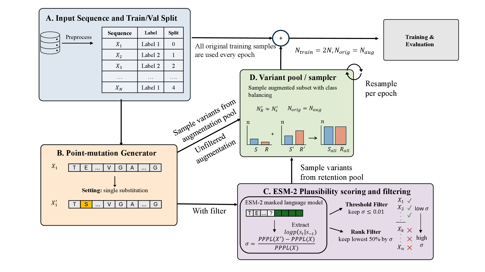
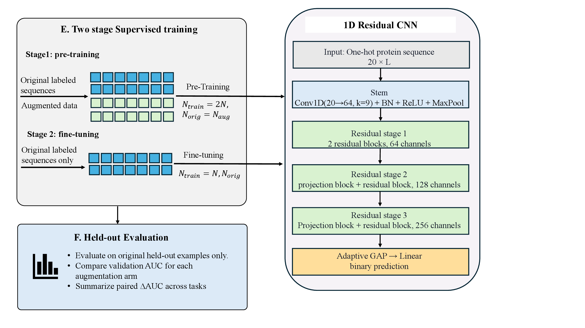
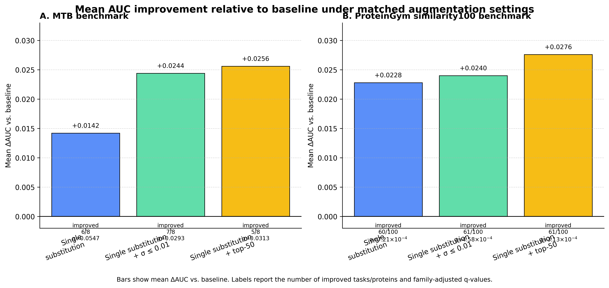

# synthetic-augmentation-protein

Code and evaluation outputs for our synthetic protein sequence augmentation project, "Protein Sequence Augmentation with Language Model Filtering for Supervised Tasks".

This repository contains the pipeline used to generate synthetic protein variants, score them with a protein language model, filter variants by sequence plausibility, train supervised classifiers, and summarize augmentation effects across BigTB and ProteinGym benchmark settings.

## Workflow overview

### A. Augmentation and plausibility-filtering framework

### B. Two-stage supervised training and held-out evaluation

### C. Cross-dataset gains under single-substitution augmentation settings

## Overview

The central workflow is:

1. Start from labeled protein-sequence classification tasks.
2. Generate synthetic variants by conservative sequence perturbation.
3. Score synthetic variants with ESM pseudo-perplexity.
4. Filter variants by score-based retention rules.
5. Train baseline and augmentation-aware classifiers.
6. Compare augmentation settings with paired statistical analyses.

The repository is organized around those stages, with code for both the core augmentation pipeline and the experiment-specific utilities used for BigTB and ProteinGym analyses.

## Repository structure

- `1_ESM_PIPELINE/`
  - core augmentation, scoring, filtering, and training code
- `scripts/`
  - experiment setup, dataset materialization, ranking, and Slurm launch scripts
- `diagnostic/00_statistical_tests/`
  - statistical comparison scripts and summary outputs
- `figures/`
  - result figures and the scripts that generate them
- `requirements.txt`
  - Python dependencies

## Workflow

### 1. Data preparation

The project expects task-specific CSV files with protein sequence columns and binary labels.

For the MTB-style experiments, the starting point is a drug-specific set of cleaned sequence tables. The main preparation utilities are:

- `scripts/build_single_mut_augmented_datasets.py`
  - materializes the single-substitution augmentation pool for MTB
- `scripts/build_proteingym_esm_filtered_datasets.py`
  - adapts ProteinGym data into the MTB-style pipeline format and builds ESM-filtered variants
- `scripts/build_proteingym_protein_panel.py`
  - creates smaller or panel-style ProteinGym subsets
- `scripts/build_proteingym_similarity_within_folds.py`
  - rebuilds within-protein folds for the `similarity100` evaluation
- `scripts/rank_proteingym_by_mtb_similarity.py`
  - ranks ProteinGym proteins by sequence similarity to the MTB target panel

### 2. Augmentation generation

Synthetic sequence generation lives in `1_ESM_PIPELINE/1_generation/`.

Key files:

- `1_ESM_PIPELINE/1_generation/generate_augmented_data.py`
- `1_ESM_PIPELINE/1_generation/augmentation.py`

This stage creates augmented sequence tables from labeled originals. In the main paper-facing experiments, the most important setting is conservative single-substitution augmentation.

### 3. ESM scoring

Language-model scoring lives in `1_ESM_PIPELINE/2_scoring/`.

Key files:

- `1_ESM_PIPELINE/2_scoring/score_augmented_with_esm.py`
- `1_ESM_PIPELINE/2_scoring/score_pppl_chunks.py`
- `1_ESM_PIPELINE/2_scoring/merge_and_score_pppl.py`

These scripts compute pseudo-perplexity-based scores for synthetic variants and write the score columns used later for filtering.

### 4. Filtering

Filtering utilities live in `1_ESM_PIPELINE/4_filtering/`.

Key files:

- `1_ESM_PIPELINE/4_filtering/generate_low_score_datasets.py`
- `1_ESM_PIPELINE/4_filtering/generate_top_percent_datasets.py`
- `1_ESM_PIPELINE/4_filtering/filtered_dataset_summary.py`

These scripts create filtered augmentation pools, including threshold-based retention such as `0.01` and rank-based retention such as `top50`.

### 5. Training

Model training lives in `1_ESM_PIPELINE/5_training/`.

Key files:

- `1_ESM_PIPELINE/5_training/train.py`
- `1_ESM_PIPELINE/5_training/run_all.py`
- `1_ESM_PIPELINE/5_training/data_module.py`
- `1_ESM_PIPELINE/5_training/models.py`

The training code supports three main modes:

- `baseline`
  - no augmentation
- `online`
  - augmentation generated on the fly without ESM filtering
- `offline`
  - pre-generated filtered augmentation pools

The `scripts/` directory contains Slurm launchers for the main experiment arms, including:

- MTB baseline, no-ESM, `mut1_0p01`, and `mut1_top50`
- ProteinGym pooled panel baselines and augmentation arms
- ProteinGym per-protein baselines and augmentation arms

### 6. Statistical comparison and summarization

Result comparison code lives in `diagnostic/00_statistical_tests/`.

Key files:

- `diagnostic/00_statistical_tests/scripts/compare_augmentation_settings.py`
- `diagnostic/00_statistical_tests/scripts/plot_bigtb_arm_distributions.py`
- `diagnostic/00_statistical_tests/scripts/plot_proteingym_similarity100_forest.py`

These scripts aggregate fold-level outputs, compute paired deltas between augmentation settings, and summarize results at the natural evaluation unit of each benchmark.

## Result folders

The main summary outputs are stored under `diagnostic/00_statistical_tests/results/`.

Important subfolders:

- `augmentation_setting_tests/`
  - BigTB full-drug comparison outputs
- `augmentation_setting_tests_no_levofloxacin/`
  - BigTB sensitivity analysis excluding levofloxacin
- `proteingym_full/`
  - full pooled ProteinGym comparison outputs
- `proteingym_eligible269_panel/`
  - stricter pooled ProteinGym panel comparison outputs
- `proteingym_eligible532_panel/`
  - broader pooled ProteinGym panel comparison outputs
- `proteingym_similarity100_within5/`
  - per-protein `similarity100` comparison outputs
- `paper_summary/`
  - compact cross-dataset summary tables and notes

These folders contain lightweight outputs such as CSV summaries, markdown reports, and comparison plots rather than full training checkpoints.

## Figures

The `figures/` directory contains exported result figures and the scripts used to build them, including:

- cross-dataset delta-AUC comparison panels
- BigTB augmentation-arm distribution plots
- ProteinGym `similarity100` delta-AUC box and violin plots
- ProteinGym per-protein forest plots

## Reproducibility notes

Some scripts assume local dataset directories that are not part of this repository. The released code captures the augmentation, filtering, training, and summarization logic, while dataset materialization depends on the corresponding local experiment inputs.

## Contact

For questions about this repository or the associated project, please contact `mtasmin@umass.edu` at UMass Amherst.
